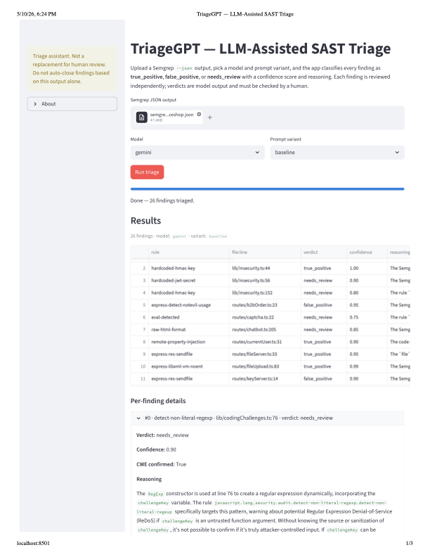

# TriageGPT

*LLM-assisted triage of Semgrep SAST findings, with structured output, prompt-variant evaluation, and Gemini × Claude provider comparison.*

**Status:** Working artifact + completed evaluation. 13 hand-labeled findings, N=5 trials per configuration. See §3 "Honest limitations" for the gaps.

## 1. Context, user, and problem

Static analysis tools like Semgrep produce dozens to hundreds of findings per scan, and 30–50% are usually false positives. TriageGPT is a Streamlit app that takes a Semgrep JSON report, runs each finding through an LLM with a structured prompt, and returns a verdict (`true_positive`, `false_positive`, or `needs_review`) with confidence and reasoning. The goal is to compress triage while keeping the human in the loop.

### User

The intended user is an Application Security engineer at a commercial software company — someone who runs Semgrep in CI and owns the queue of findings that come out the other side. They are not looking for an oracle; they want a first pass that flags the obvious noise and surfaces what deserves attention.

### Workflow

A scan completes, dumps a JSON file with findings, and today the engineer reads each rule description, the flagged code, and the CWE mapping before deciding one of three outcomes per finding. The app compresses the reading step: upload the JSON, pick a model and prompt variant, and get the verdict pass with reasoning attached.

### Why this matters

The choice today is usually between ignoring SAST output (and missing real bugs) or flooding developers with noise (and losing trust). Triage is the bottleneck that produces that choice. A reliable pre-classifier lets the AppSec engineer spend their time on the findings that actually warrant it, rather than the rule-firing noise.

## 2. Solution and design

TriageGPT pulls a snippet for each Semgrep finding, builds a prompt anchored on the rule and CWE metadata, then asks an LLM for a structured response that's validated against a Pydantic schema before reaching the UI. The same engine supports three prompt variants and two model providers, so the same finding can be triaged in six configurations and compared head-to-head.

### Architecture

For each finding, the engine reads a context window of three lines on either side of the flagged code from disk. Semgrep's open-source output omits source snippets, so this happens locally. The rule ID, CWE, severity, and rule description are interpolated into a prompt template along with the snippet. The LLM is called in structured-output mode and the response is parsed against the Pydantic schema — verdict, confidence, reasoning, remediation, CWE confirmation.

### Prompt variants

I tested three variants. **Baseline** is a direct instruction to classify the finding and explain the reasoning in JSON. **No_path_bias** adds one sentence telling the model to ignore the file path, project name, and repository reputation — this addresses a failure mode I saw early on, where the model concluded a finding must be exploitable because the word "juice-shop" appeared in the path. **Few_shot** adds three worked examples drawn from my own hand-labeled ground-truth set, each showing line-anchored reasoning and proper escalation to `needs_review` when context is insufficient. The three findings used as examples are excluded from any evaluation of the few-shot variant.

### Model providers

Both Gemini 2.5 Flash and Claude Haiku 4.5 are wired in. Gemini uses its native structured-output mode; Claude uses tool-use with a single forced tool call. Both providers receive the same prompt and produce the same shape of response, so prompt-level effects can be compared against model-level effects directly. This addresses the course concept on provider selection: same prompt across model families, so any difference in output is attributable to the model, not the prompt.

## 3. Evaluation and results

The evaluation harness runs the same finding through every prompt variant × model combination N times and computes match rate against a hand-labeled ground-truth set. The current run covers 13 findings × 3 prompts × 2 models × 5 trials = 360 attempts, with class-stratified analysis to surface what the pooled aggregate hides.

### Methodology

I hand-labeled 13 Semgrep findings from an OWASP Juice Shop scan, covering all three verdict classes (8 `true_positive`, 2 `false_positive`, 3 `needs_review`). The eval harness runs each (label, variant, model) cell N=5 times to reduce single-shot LLM noise, persisting each trial's verdict, confidence, reasoning, latency, and any errors to a results JSON. Few-shot contamination is handled explicitly: the three findings that appear as worked examples in the few_shot prompt are excluded from any evaluation of that variant, because measuring it on its own demonstration data would be testing prompt-copying rather than triage skill. A like-for-like analysis pass recomputes match rate on only the 10 non-contaminated labels so variants can be compared on a common subset.

### Baseline comparison

The within-system baseline is the zero-shot baseline prompt — no anti-bias instruction, no worked examples. Running the same model against both baseline and the other variants isolates prompt engineering as the only changing variable. The headline metric is match rate against the human ground-truth verdict, but pooled match rate hides class-level differences (a model that always returns `true_positive` would look strong on a TP-heavy label set). The analysis reports both pooled and class-stratified rates.

### Match rate by configuration (like-for-like)

| variant      | model  | match rate | n_trials |
|--------------|--------|-----------:|---------:|
| baseline     | gemini | 60.0%      | 50       |
| baseline     | claude | 72.0%      | 50       |
| no_path_bias | gemini | 64.0%      | 50       |
| no_path_bias | claude | 68.0%      | 50       |
| few_shot     | gemini | 68.0%      | 50       |
| few_shot     | claude | **78.0%**  | 50       |

The strongest configuration is `few_shot__claude` at 78%, with `baseline__gemini` at the bottom at 60% — an 18-percentage-point spread across configurations. Claude beats Gemini on every prompt variant (+12 on baseline, +4 on no_path_bias, +10 on few_shot). The cross-model gaps survive the like-for-like correction, so the Claude-over-Gemini effect is not an artifact of the contamination-skip mechanism.

### Per-class breakdown

Aggregate match rate looked competitive across all six cells, but stratifying by ground-truth verdict class reveals genuinely different model behaviors per class:

| variant      | model  | gt_class         | n_trials | match_rate |
|--------------|--------|------------------|---------:|-----------:|
| baseline     | gemini | true_positive    | 40       | 70.0%      |
| baseline     | gemini | false_positive   | 10       | 70.0%      |
| baseline     | gemini | needs_review     | 15       | 13.3%      |
| baseline     | claude | true_positive    | 40       | 60.0%      |
| baseline     | claude | false_positive   | 10       | 100.0%     |
| baseline     | claude | needs_review     | 15       | 46.7%      |
| no_path_bias | gemini | true_positive    | 40       | 72.5%      |
| no_path_bias | gemini | false_positive   | 10       | 40.0%      |
| no_path_bias | gemini | needs_review     | 15       | 26.7%      |
| no_path_bias | claude | true_positive    | 39       | 59.0%      |
| no_path_bias | claude | false_positive   | 10       | 100.0%     |
| no_path_bias | claude | needs_review     | 15       | 33.3%      |
| few_shot     | gemini | true_positive    | 30       | 63.3%      |
| few_shot     | gemini | false_positive   | 10       | 100.0%     |
| few_shot     | gemini | needs_review     | 10       | 50.0%      |
| few_shot     | claude | true_positive    | 30       | 66.7%      |
| few_shot     | claude | false_positive   | 10       | 100.0%     |
| few_shot     | claude | needs_review     | 10       | **90.0%**  |

Claude is perfect on `false_positive` cases across all three prompts (100%, 100%, 100%) — when it sees code that's safe, it says so reliably. Gemini's `no_path_bias` variant collapses on FPs to 40%, an unintended consequence of the anti-bias instruction that ironically over-flags. The `needs_review` class spans 13.3% to 90.0% across the six cells, with `few_shot__claude` the standout — when humility is the right answer, worked examples teach the model to recognize that. Pooled match rate is a misleading metric without class stratification.

### Honest limitations

N=5 trials per (finding, variant, model) cell aggregates to ~50 trials per (variant, model) cell, with standard error on a binomial proportion at p≈0.6 of roughly ±7 percentage points. The +12 and +10 cross-model gaps clear that noise floor comfortably; the +4 gap on no_path_bias does not. The label set is small (13 findings) and FP-light (2), so specificity claims rest on thin evidence. Only one labeler. One transient Claude validation error fired during the run — the tool-use response leaked literal XML closing tags into a boolean field, which Pydantic correctly rejected. This is itself an interesting production edge case for structured-output systems.

## 4. Artifact snapshot

The Streamlit Triage app is the user-facing entry point: upload a Semgrep `--json` file, pick a model and prompt variant, and watch verdicts stream in one finding at a time. The screenshot below shows the app running against the 26-finding scan of OWASP Juice Shop with the baseline prompt on Gemini — summary table at the top, per-finding expanders below — and the JSON sample after it shows the structured shape behind every row.



*Streamlit Triage app showing baseline Gemini verdicts on the 26-finding Juice Shop scan.*

### Sample output

A single triage call returns a `TriageVerdict` object validated against the Pydantic schema. The shape is fixed across every call — verdict, confidence, reasoning, remediation, and a CWE confirmation flag — which is what makes downstream automation (CI gates, ticket creation, dashboards) tractable. Here's the full structured output for finding 13, an unparameterized SQL query in Juice Shop's login route that's the clearest true-positive in the test corpus:

```json
{
  "verdict": "true_positive",
  "confidence": 0.95,
  "reasoning": "Line 34 constructs a SQL query via template literal interpolation, embedding req.body.email and the hashed req.body.password directly into the query string passed to sequelize.query(). There is no parameterization, no ORM query builder, and no escape function applied. Because req.body is untrusted input from the login POST, a payload like ' OR 1=1 -- in the email field terminates the string literal, matches all rows, and bypasses authentication.",
  "remediation": "Use parameterized queries with placeholders via Sequelize's replacements option, or switch to the ORM's findOne with a where clause. Both options pass the user input as data rather than concatenating it into the SQL string.",
  "cwe_confirmed": true
}
```

## 5. Setup and usage

### Prerequisites

- Python 3.10+ (project tested on 3.13)
- A Gemini API key from [Google AI Studio](https://aistudio.google.com/apikey) — free tier sufficient
- An Anthropic API key from [console.anthropic.com](https://console.anthropic.com) — no free tier, requires a small credit balance
- macOS or Linux (Windows not tested)

### Install

```bash
git clone https://github.com/Papuzzio/sast-llm-triage.git
cd sast-llm-triage
python3 -m venv .venv
source .venv/bin/activate
pip install -r requirements.txt
```

### Configure

Copy `.env.example` to `.env` and paste your two API keys on the corresponding lines:

```
GEMINI_API_KEY=your_gemini_key_here
ANTHROPIC_API_KEY=your_anthropic_key_here
```

The `.env` file is gitignored.

### Run the Streamlit app

```bash
streamlit run app/triage_app.py
```

The browser opens to `http://localhost:8501`. Upload a Semgrep JSON file (`data/semgrep_juiceshop.json` is included in the repo for testing), pick a model and prompt variant, and click **Run triage**. Verdicts stream into the table as each finding is processed.

### Run the evaluation harness

```bash
python3 scripts/run_eval.py
```

This runs all 13 labeled findings through all six configurations (3 prompts × 2 models) at N=5 trials per cell — ~360 API calls and ~30 minutes wall clock. Per-trial results land in `eval/results_<timestamp>.json` and a summary table prints to stdout.

### Repository layout

- `src/` — core engine, schema, model clients
- `app/` — Streamlit UI
- `scripts/` — `run_eval.py` and helpers
- `eval/` — `ground_truth.json` + analysis files
- `notes/` — lab notebook (`observations.md`)
- `data/` — Semgrep scan output
- `screenshots/` — artifact snapshot for README
